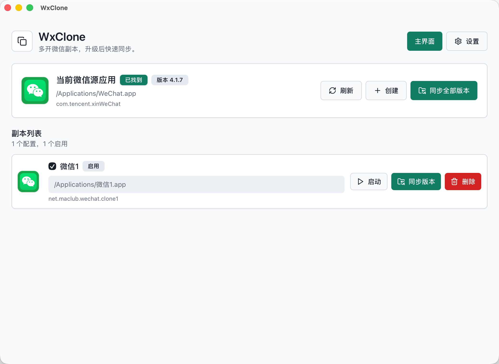
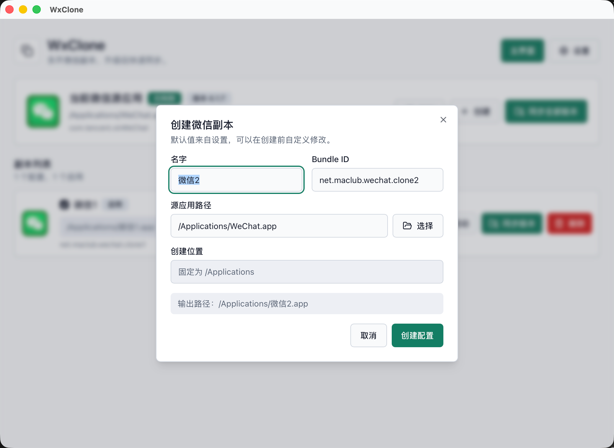

# WxClone

<p align="center">
  
</p>

一个简单的 macOS 微信多开管理器。它把手工命令包装成 Tauri 应用，支持配置多个克隆槽位，并在微信升级后可以统一同步重建。

## 截图

<p align="center">
  
</p>

<p align="center">
  
</p>

## 功能

- 主界面显示当前微信源应用状态和版本。
- 主界面和副本列表优先显示真实 `.app` 图标。
- 设置界面配置基础名字、基础 Bundle ID、源应用路径；创建位置固定为 `/Applications`。
- 创建副本时自动按设置生成名字序号和 `.clone1`、`.clone2` 形式的 Bundle ID，也可以手动修改。
- 创建弹窗支持选择源应用，输出位置固定为 `/Applications`。
- 创建前检测名称、Bundle ID、目标路径冲突。
- 同步已有副本时，如果目标位置存在其他 Bundle ID 的应用会停止，避免误覆盖。
- 同步单个副本，或一键同步全部启用副本。
- 启动指定副本。
- 删除指定副本应用，并移除对应配置。

## 开发

```bash
pnpm install
pnpm tauri:dev
```

## 构建

```bash
pnpm tauri:build
```

## 说明

同步副本时需要写入 `/Applications` 并重新签名应用，因此 macOS 会弹出管理员授权。该工具只重建应用包，不会删除微信聊天记录。微信升级后，重新打开 WxClone 点击“同步全部”即可让副本跟随新版应用。

免责声明：本工具仅用于本机微信应用多开副本管理，不保证微信账号一定不会被误封，使用前请自行评估风险。

管理员脚本的详细执行日志会追加保存到：

```text
~/Library/Logs/com.richqaq.wxclone/wxclone.log
```

## 参考

- [chowyu12/wechat](https://github.com/chowyu12/wechat)
